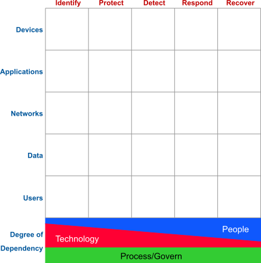

# 26大企業紅藍隊攻防演練:從企業永續報告書精進資安網路攻防框架
## [Cyper Defense Matrix](https://cyberdefensematrix.com/)
可用於辨認企業資安資源配置，檢視企業內部資安整體狀況的方法論，用全面的方式檢視目前資安防護是否有漏缺或重複投資。

## [CyperKillChain](https://www.lockheedmartin.com/en-us/capabilities/cyber/cyber-kill-chain.html)

1. 偵查 Reconnaissance: 攻擊者收集目標對象的資料，如電子郵件信箱、社群平台的資料，以找到可以下手的弱點；或是透過工具，掃描目標對象的網站、系統，得知使用的系統種類、版本。
    - 紅隊
        1. 主動偵查
            - 攻擊者積極尋找目標系統的漏洞和弱點，例如：使用掃描工具尋找開放的端囗，以及利用漏洞來獲得更多訊息。
                - 掃描工具
                    1. Proxy: 用以隱藏攻擊者IP
                        - 透明 (Transparent) - 目標伺服器知道攻擊者的IP位址，並且知道攻擊者正在透過代理伺服器進行連接。
                        - 匿名 (Anonymous) - 目標伺服器不知道攻擊者的IP位址，但它知道攻擊者正在使用代理。
                        - 精英或高匿名 (E11te) - 目標伺服器不知道攻擊者的IP位圵，或請求是透過代理伺服中繼的。
                    2. 偵察工具:
                        - nmap
                        - shodan
        2. 被動偵查
            - 觀察線上/線下足跡，例如：社交媒體、公開文件、網站，甚至從垃圾桶搜集資訊。
    - 藍隊
        - 更新軟體: 漏洞修補
2. 武裝 Weaponization: 攻擊者使用現成的開源工具或是自行開發專屬的惡意程式。
    - 紅隊
        - 投入資源到暗網上買武器來測試自家的軟、靭體，在測試環境裡面了解勒索軟體或攻擊者攻擊程式的思維、並與藍隊合作。
    - 藍隊
        - 沙箱
            - 用虛擬主機(例如 Oracle Virtual Box)，架設網路環境，包含受駭主機(例如Windows 10/11)、威脅獵捕主機(例如 Wazuh)。 然後在啟用快照功能下，執行惡意程式，再分析封包分析主機所收到的資料，藉此了解動態環境下，惡意程式做了什麼。
        - 反組譯程式
            - 在靜態環境下，我們想知道惡意程式會做那些功能(但不執行)。
        - 威脅獵捕軟體
            - Graylog
            - ELK
            - Suricata
            - Splunk(付費)
            - Wazuh
3. 遞送 Delivery: 攻擊者將攻擊武器送入目標的系統內，如透過釣魚信件裡的連結、夾帶木馬的盜版軟體、隨身碟。
    - 紅隊
        - 主動
            - 社交工程
                - 釣魚郵件
                - 勒索郵件
                - 投資詐騙郵件
                - 假冒社交媒體通知
                - 假冒親友或同事
            - 用短網址隱藏病毒下載網址
        - 被動
            - 水坑式攻擊：攻擊者通過猜測(或觀察)確定這組目標經常訪問的路徑，然後埋設惡意程式。
            - 魚叉式攻擊：針對某特定目標量身訂作的攻擊手法，如網路購物後，外洩個資用來發email詐騙。
    - 藍隊
        - 教育訓練
        - 網址反查
            - Virustotal: https://www.virustotal.com/gui/home/url
4. 漏洞利用 Exploitation: 確保遞送的惡意軟體，藉由目標對象的系統漏洞，得以順利開啟，並使攻擊者獲得控制權。
   - 紅隊
       - 多方嘗試各種被披漏的漏洞
          - GitHub
          - 暗網
          - Hack研討論
          - Firefox插件
   - 藍隊
       - 建置偵測及應變機制
          - EDR: 端點偵測與回應
              - 監控端點設備上的行為、檢測惡意活動、提供威脅情報和支援事件回應。通常具有強大的記錄和分析功能。
          - NDR: 網路偵測與回應
              - 專注於監控企業網路流量、分析威脅行為並進行回應的技術，可以與EDR形成互補，幫助企業在網路層面偵測到威脅並迅速應對，防止攻擊擴散。
          - XDR: 延伸偵測與回應(EDR + NDR + 電子郵件安全 + 雲端安全 + etc...)
              - 整合多個安全工具和資料來源包括網路、雲端、伺服器等，以實現更全面的威脅偵測和回應。
          - MDR: 代管式偵測與回應(由外包人員所提供服務)
              - 由專業安全分析師提供，他們使用先進的安全工具和威脅情報，以監控網路、端點、應用程序等，以快速檢測並回應威脅。
          - Nessus， nmap掃描
5. 安裝 Installation: 攻擊者確保自身可以長期控制目標的系統內，以有足夠的時間進行後續環節。
    - 紅隊
        - 寄生攻擊 Living Off-the-Land（LoL）: 攻擊者利用受駭電腦裡現成的工具，來執行攻擊行動的有關任務。
            - Fileless 無檔案式攻擊: 將惡意程式匿於記憶內。
                - PowerShell
                - SCHTASKS
                - WMIC
                - PSEXEC
                - Mimikatz
    - 藍隊
        - 重現紅隊攻擊順序以複測
            - Kali Caldera Agent
        - 防止遠端代碼執行漏洞
            - 及時更新和修補: 定期更新作業系統、應用程式和相關的軟體更新，以確保您的系統不受已知漏洞的影響。
            - 最小許可權原則: 限制應用程式和使用者的許可權，確保他們的帳號只能訪問他們實際需要的資源，減少潛在的攻擊面。
            - 輸入驗證與過濾: 在編寫應用程式碼時，始終進行嚴格的輸入驗證和過濾，確保不會將用戶輸入作為代碼執行的一部分。
            - 安全編碼實踐: 遵循安全的編碼標準和最佳實踐，使用安全的開發框架和函式庫，以減少漏洞的產生。
            - 網路防火牆與入侵偵測系統: 使用網路防火牆和入侵偵測系統來監控和阻止潛在的攻撃行為。
            - 安全審計和監控: 實施安全審計和監控機制，以便及時檢測異常行為和潛在攻擊。
            - 安全培訓: 對開發人員和系統管理員進行安全培訓，以提高他們對安全風險的認識，並學習如何預防遠端代碼執行漏洞。
            - 及時修復: 當懷疑系統中存在遠端代碼執行漏洞時，務必及時修復，並確保您的系統和應用程式保持最新、安全的狀態。
6. 發令與控制 Command & Control: 本環節取兩個單字的字首，又可簡稱為 C2。攻擊者潛伏在目標的系統內，收集資料，探索環境，以便審慎規劃後續行動。
    - 紅隊
        - 避免被EDR軟體發現
            - 混淆：將攻擊用指令編碼混淆。
            - 加密
            - 將資料切成小塊
    - 藍隊
        - 只開啟必須的連線
7. 行動 Actions: 根據攻擊者的最終目標，採取行動。
    - 紅隊
        - 破壞系統
        - 竊取機密資料
        - 勒索目標對象
        - 刪除還原檔
        - 埋入後門
    - 藍隊
        - 中斷網路
            - 嘗試檔案解密
            - 從備份還原
        - 解析攻擊脈絡
            - 尋找解密工具：https://www.nomoreransom.org/zh/index.html

## [MITRE ATT&CK](https://attack.mitre.org/)

1. 偵查 Reconnaissance: 包括讓攻擊者主動或被動收集可用於支援目標定位資訊的技術。此類資訊可能包括受駭者組織、基礎設施或員工/人員的詳細資訊。攻擊者可以利用這些資訊來幫助進行其他階段攻擊，例如使用收集到的資訊來規劃和執行初始訪問，確定攻陷企業資訊資產後目標的範圍優先等級，或推動進行進一步的偵察工作。
    - 紅隊
        - 找到企業與外界接觸的網站或伺服器，或者公開的電子郵件等，收集情資的過程可以幫助攻擊者了解企業內部環境與關鍵人士。
        1. 主動掃描
        2. 社交工程
        3. 情資搜集
            - 暗網情資網站集合
                - Tor Browser + VPN(高危操作)
                - https://surfshark.com/zh-hk/blog/tor-websites
            - 公開情資網站集合
                - https://osintframework.com/
    - 藍隊
        - 業界攻防情資及最新業界動向
            - https://www.twcert.org.tw/tw/mp-1.html
            - https://antiransom.tw/
2. 資源開發 Resource DeveIopment: 攻擊者正試圖建立可用於支持行動的資源。資源開發包括涉及對手創建、購買或損害/竊取可用於支援目標的資源的技術。
    - 紅隊
        - 基礎設施: 如網域、電子郵件、程式碼簽署憑證等
        - 帳戶
        - 功能
        - 搜集email
            - Linkedin
            - 免費Email搜尋: https://www.signalhire.com/
    - 藍隊
        - 在暗網尋找資源洩漏
            - 資料侵害結果摘要: https://one.google.com/
3. 短兵相接 Initial Access: 包括使用各種進入點，以在網路中獲得初始立足點的技術。用於獲得立足點的技術包括有針對性的魚叉式網路釣魚和利用面向公眾的網路伺服器上的弱點。獲得的立足點可能允許繼續訪問，例如取得有效帳戶和使用外部遠端服務。但也可能由於使用者更改密碼而限制後續使用。
    - 紅隊
        - Kali Linux+Metasploit
        - 透過使用者的信任，開啟惡意程式後取得立足點
            1. 隨身碟(或其他外部儲存媒體)自動執行功能
            2. 對企業面向外部的服務例如網站進行SQL injection等攻擊
            3. 有效帳號(用鍵盤側錄程式、社交工程取得)
                - 攻擊者會架設混淆在搜尋結果中的網站，如果誤點，網站就會跳出例如「您已經中大獎，請輸入連繫資料，以便領取槳金」，然後要求輸入個人資料，進而要求註冊(輸入帳號密碼)，而很多使用者都是同一組帳號密碼在多個網站使用，就會中招。
            4. 供應鏈攻擊
                - 上傳惡意程式到各大儲存庫(NPM/PyPi/VSCode Marketplace等) https://www.informationsecurity.com.tw/article/article_detail.aspx?aid=10482
    - 藍隊
        - 減少攻擊面及可能性
        - 使用者教育訓練
        - 主動回報釣魚網站
            - https://safebrowsing.google.com/safebrowsing/report_phish/?hl=en
4. 執行 Execution: 這個步驟是為了探索企業內部的網路狀態或竊取資訊，以便配合其他之後階段的目的，而讓受駭者的主機執行惡意指令。由於近代資訊系統的多樣性，能執行指令的像是Windows主機命令列(CMD)、PowerShell、Mac的Apple Script、容器、程序間溝通、API、雲端、Windows Management Instrumentation(WMI)
    - 紅隊
        - 嘗試不斷地建立新的攻擊方式以執行惡意指令，登入受駭系統並且利用就地取材的工具，進-步清楚企業的網路拓撲並尋找有價值資產
        - 要解決的二個問題：一個是如何從外部連接到受駭系統的內部IP
        - 進到內部環境以後誘騙使用者點擊惡意程式連結藉以開啟特定服務
    - 藍隊
        - 製作或付費購買白名單和黑名單，無論企業的防火牆、情資共享、特徵值萃取、端點防護系統，都會有網址、IP、程式的白名單和黑名單
        - Indicators of compromise(IOC， 失陷指標): 是以結構化的方式記錄事件的特徵和證物的過程，可作為主機系統或網路潛在入侵的取證證據，使資訊安全(InfoSec)專業人員和系統管理員能夠偵測入侵嘗試或其他惡意活動。
            - https://www.trendmicro.com/vinfo/us/security/definition/indicators-of-compromise
5. 潛伏 Persistence: APT進階持續性威脅，指的是長期潛伏在目標組織(企業、個人)，默默地收集資訊。
    - 紅隊
        - 要做到不隨著用戶關機或更改密碼而與受駭電腦失去聯繫，攻擊者可以有好幾種做法像是：
            1. 自己新增一組帳號
            2. 設定開機時自動執行惡意程式或一段程式碼
            3. 修改系統應用程式執行流程(例如在ntdll.dll上面附加惡意程式)
            4. 修改開啟檔案的預設應用程式
        - 現實案例
            - https://attack.mitre.org/groups/
        - 攻擊者工具
            - Malware-as-a-service(MaaS)
            - 一定要買正版軟體，因為免費版極有可能暗藏惡意程式
            - 代碼開源相對安全
    - 藍隊
        - 重點在於及早發現攻擊者的指令和活動。
        - 透過教育訓練讓使用者檢查電腦是否有異狀。
6. 權限提升 Privilege Escalation: 目前拿到一般使用者權限的攻擊者，想要提升到高權限，通常是透過系統的弱點(比方一定要開的網站管理介面，或是某機器設備一定要開某一個well know port)、系統設定的不健全、系統的漏洞。
    - 紅隊
        1. 先用nmap掃描服務
        2. 再用工具列舉所用函式，如：https://github.com/kubernetes-sigs/bom
        3. 最後找相對應的軟體(或購買)來爆破
    - 藍隊
        1. 關閉系統管理員帳戶
        2. 使用者只能用自己帳號登入使用
        3. 稽核系統帳號或PowerShell命令執行事件
7. 防禦規避 Defense Evasion: 攻擊者在整個攻擊過程中用來避免檢測的技術。用於規避防禦的技術包括卸載/禁用安全軟件或混淆/加密數據和腳本。另外可以利用和濫用受信任的進程來隠藏和偽裝惡意軟體，並且可以建立沙箱和程式偵錯器規避以避免自己的運作模式被分析。
    - 紅隊
        - 執行次數少而平均，耐心避免被發現
    - 藍隊
        - 兼顧事件的檢視與災害復原
        - 處理受駭主機
        - 依ISO27001標準災難還原流程，設定RTO(Recover Time Objective, 最長可以忍受的不時間)
        - 如果RTO時間很短，先切換到備用伺服器
        - 如果RTO時間較長，報警並通知資安險保險公司。拔除網路線、保持發現時的原始狀態(即未關機的電腦先不要關機、才有機會傾印記憶體內容；已關機的電腦不要開機，以防勒索病毐加密更多的檔案)
        - 保全現場(機房出入登記表、禁止非保險公司授權的人進出)並等待檢調單位(或保險公司指定的合格事件實驗室)至現場取證(避免污染數位證據，也避免檔案的存取日期異動影響證據力)
        - 事件鑑識結果出爐後還要提吿入侵者，伺服器的硬碟會是證物。而訴訟時間冗長，所以拿回來時硬體規格上也過時陳舊了。但是備援的伺服器一樣要做事件鑑識，將漏洞都做修補或者採用可選用的緩解措施
8. 取得登入憑證 Credential Access: 攻擊者開始竊取帳號密碼
- 紅隊
    - 可透過木馬程式將使用者輸入按鍵記錄(Keylogger)下來
    - 或者直接竊取帳號密碼檔案
    - 中間人攻擊，竊取cookies/token/帳號密碼
    - 建立隱藏帳號： https://3gstudent.github.io/%E6%B8%97%E9%80%8F%E6%8A%80%E5%B7%A7-Windows%E7%B3%BB%E7%BB%9F%E7%9A%84%E5%B8%90%E6%88%B7%E9%9A%90%E8%97%8F
- 藍隊
    - 嘗試用工具軟體如Yara建立惡意程式指紋
9. 探察 Discovery: 攻擊者會使用獲取有關系統和內部網路知識的技術，幫助攻擊者觀察環境並決定如何行動之前確定方向。探索可控制及立足點周圍的內容以便入侵目標機器。通常會使用本機作業系統所提供的公用程式。
    - 紅隊
        - 尋找有價值資訊
            - 使用者的瀏覽器資訊
            - 雲端資訊
            - 容器(Container)資訊
            - 網域信任關係資訊
            - 群組政策(GPO)
            - 網路分享資料夾資訊
            - 群組權限資訊
            - 網路封包監聽與破解
            - 註冊表(Registry)查詢
            - 系統管理員(或使用者)帳號資訊
        - 工具有
            - Netstat
            - IPConfig/IFConfig
            - ARP快取
            - 本機路由表
            - PowerShell
    - 藍隊
        - 減少攻擊面
            - 實體網路區隔
            - 防火牆
            - 密罐(Honeypot): https://github.com/paralax/awesome-honeypots
10. 橫向移動 Lateral Movement: 攻擊者開始探索網路以找尋目標進行連線，通常需要從多個系統和帳戶來取得。攻擊者可能會安裝自己的遠端攻擊工具或者使用本機網路和作業系統工具本身附帶的工具或程式，可更加隱蔽。
    - 紅隊
        - Browser Information Discovery
            - 用GooglePasswordDecryptor.exe取得瀏覽器儲存的所有主機的帳號密碼
    - 藍隊
        - 安全程式開發
            - 最小權限
            - 雙/多因素身份驗證
11. 收集資料 Collection: 攻擊者已可以控制有價值的受駭主機
    - 紅隊
        - 透過各種管道收集使用者的軌跡
            - 攝影機
            - 鍵盤(Keylogger)
            - 滑鼠
            - 螢幕截圖
        - 下一個目標是竊取(滲透)資料
            - 瀏覽器資訊
            - 聲音檔
            - 視訊檔
            - 電子郵件
            - 剪貼簿
            - 程式庫設定檔案
        - 設定郵件轉寄，藉此收集機密資訊
    - 藍隊
        - 依ATT&CK框架提供的偵測及緩解方式
        - 可視化事件檢視工具
12. 遠端命令與控制Command and Control(C2):攻擊者將資料傳回自己的C2伺服器。過程中會加密、加上各種字段以混淆攻擊
    - 紅隊
        - 傳送資料方法可透過應用程式層的通訊協定
            - 電子郵件
            - 網站伺服器
            - 資料庫
            - 檔案伺服器 FTP
            - 名稱解析服務伺服器 DNS
            - 動態改變位罝的名稱解析服務伺服器 DNS
            - 隨身碟
            - 非應用程式層的通訊協定
                - ICMP
                - UDP
                - SOCKS
        - 由於內連外(輸出規則)相比於外連內(輸入規則)較不會被防火阻擋，攻擊者可能會建立Reverse Shell
            - 攻擊者先監聽某個特定的port，接著在受駭主機輸入指令，讓受駭主機主動與攻擊者的主機連線，攻擊者就能夠直接輸入指令在受駭主機執行。
    - 藍隊
        - 主動式防禦，如威脅獵捕軟體Splunk(付費)
        - Splunk可結合APT攻擊紀錄資料，重現攻擊紀錄
            - IP
            - 時間點
            - 攻擊手法
13. 資訊洩漏 Exfiltration: 攻擊者開始竊取企業內部資料
    - 紅隊
        - 透過Web
        - 儲存媒體
        - 雲端
        - 網路通訊
        - C2 server
        - 將收集的數據壓縮加密成封包，避免在刪除數據時被發現
        - 還可能包括對傳輸設置大小限制
    - 藍隊
        - 防止惡意軟體感染或資料外洩首先要正確維護基礎設施，無縫修補仍為核心
        - 系統保持最新的更新(HotFix)
14. 實質損害 Impact: 攻擊者會試圖操縱、中斷或破壊系統和資料。攻擊者通過操縱商業和營運流程來破壞資安三要素中的機密、可用性、完整性。
    - 紅隊
        - 目標
            - 勒索虛擬貨幣或金錢
            - 竊取商業機密
            - 複製受駭公司客戶個資、訂單及信用卡資訊
            - 刪除或加密受駭公司電腦資料
            - 預留後門並刪除入侵紀錄檔以便再次入侵
        - 手段
            - 破壞或篡改數據
            - 移除使用者帳號
            - 中斷系統或端點服務或運作
            - 資料抹除
            - 資料加密
            - 資料操縱(成為攻擊者想要的結果,比方説前陣子某超商的電子看板被置換內容)
            - 資源挾持(公司無法操作系統,例如影印機不斷印出資料庫中機密資訊)
            - 系統關機或重開機
            - 系統服務被關閉
            - 路由器、匣道器等硬體中所內含的韌體及紀錄被毀損
    - 藍隊
        - 組態加嚴(GCB)
        - 入侵紀錄分析

## [Cybersecurity Framework](https://www.nist.gov/cyberframework)
1. 辨認風險與環境 Identify: 決定組織疆界與需投入的資源。
    1. 資產管理： 組織內外部的資訊資產被列出，分類並界定其重要性。
    2. 商業環境： 組織的使命、目標、活動的相對重要性被建立並經過溝通，建立關鍵服務運行的恢復能力。
    3. 治理： 內外部成員網路安全的角色和責任經過協調且保持一致、關於網路安全的法律和主管機關要求，例如隱私和公民自由都得到理解和管理。
    4. 風險評估： 資產風險被辨認和紀錄、從網路或其他來源得到網路威脅情報、辦認並紀錄內外部威脅、威脅漏洞可能性和影響被用於確認風險。
    5. 風險策略管理： 組織建立管理和同意風險管理流程，風險容忍策略事先建立並清楚表示，風險承受能力取決在關鍵基礎設施。
    6. 供應鏈風險管理: 由組織利害關係人識別、建立、評估，使用網路供應鏈風險評估流程，以合約和第三方實現網路安全計劃為供應商和第三方做風險回應和恢復計畫測試。
    - 紅隊
        - 從FQDN定位IP位址： https://www.whois365.com/tw/
    - 藍隊
        - 資產盤點，盤點出雲端與地端環境
2. 保護 Protect:
    1. 連接實體和數位資產的權限僅限被授權的使用者、流程和設備(身份管理和存取控制)。
    2. 資安意識教育訓練、相關政策、程序、協議(資安意識及訓練)。
    3. 資訊和紀錄檔受到管理，保護機密性、完整性、可用性(資料安全)。
    4. 訂定資安政策、安全流程、程序，以管理和保護資訊資產(資訊保護流程和程序)
    5. 維護和修理資訊系統元件(維護)。
    6. 管理技術面議題，確保安全、彈性，並遵循組織的政策、程序和協議(防護技術)。
    - 紅隊
        - 找到有價值的資產
            1. 網域AD主機(因為能橫向移動)
            2. 資料庫和NAS主機(能勒索贖金)
    - 藍隊
        - 建立情資平台
        - 購買資安保險
3. 偵測 Detect: 找出異常、持續監控、優化偵測。
    1. 建立基準的資料流程、分析檢測事件、從多個來源分析事件(異常和事件管理)。
    2. 監控網路和實體環境、監控人員活動、監控惡意程式和自動排程執行的程式碼、監控未經授權的人員、連線、設備，進行漏洞掃描(安全持續監控)。
    3. 偵測的角色(專責資安人員)責任明確丶偵測過程要經過測試、時常溝通不斷改進(優化偵測)。
    - 紅隊
        - 尋找突破點，如金管會保險局的裁罰網頁，是紅隊人員做滲透測試的一個重要參考，對於各家業者被裁罰的系統、缺失都列明，值得參考
        - https://www.ib.gov.tw/ch/home.jsp?id=42&parentpath=0,2&mcustomize=multimessage_list.jsp
    - 藍隊
        - 網站憑證
            - 檢查憑證簽章演算法等級
            - 檢查發行者
        - 數位簽章
            - 檔案>右鍵>內容>數位簽章>簽署人
            - 檔案>右鍵>內容>數位簽章>詳細資料>檢視憑證>有效期間
            - 檔案>確認雜湊值
4. 回應 Response:
    1. 對於檢測到的資安事件要加以因應(回應規劃)。
    2. 當需要回應事件時，必須讓每個人知道他們該做什麼，和做事情的順序；資安事件的報吿符合既定標準格式和利害關係人協調和分享威脅情資(溝通)。
    3. 偵測系統的情資必須加以精確的分析、實施數位鑑識、建立漏洞資料庫(分析)
    4. 控制事件的災難性後果、減輕影響、將新漏洞的影響最小化(減輕)。
    5. 從過往經驗中成長、保持事件回應策略的更新(提升)。
    - 紅隊
        - 可重現自動化攻擊，才能方便和藍隊做交流討論
        - 解決方案(付費) ArgusHacker: https://ingress.lkc-lab.com/#products
    - 藍隊
        - 有效取證：例如個資外洩的主機存取紀錄會偵測到什麼?
            1. 將主機存取紀錄檔設為每日自動備份，並設定唯讀權限防止竄改。
            2. 優先關注使用者是否提升至系統管理員權限，並執行程式或刪除紀錄。透過入侵偵測系統備份封包並即時監控，以應對異常行為。
            3. 分析提升權限後是否下載惡意程式或傳輸重要資料，運用機器學習技術偵測異常攻擊。駭客可能使用小封包分散傳輸，因此需特別注意異常時間、位址及 Port 的封包活動。
        - 防禦措施：隔離斷網與關閉電源是最有效方式。發現跳板機器後，立即隔離並拔除網路線，防止駭客下指令，再關閉電源以避免資料刪除。
        - 建立威脅觸發規則，可從以下三方面入手：
            1. 漏洞資料庫：[NVD](https://nvd.nist.gov/)（國家弱點資料庫）提供最新漏洞資訊，可搭配資產與軟體版本清單進行搜尋。
            2. 使用者需求分析：使用者是資安關鍵，應透過教育與事件分享提升其安全意識，使其能提出適合的安全作業流程。
            3. SBOM（軟體物料清單）：NIST 推動的新標準，透過 SBOM 追蹤軟體依賴函式庫，結合漏洞資料庫檢查是否需更新或移除，以提升資安。
5. 災後復原 Recovery:
    1. 在網路安全事件期間或之後執行恢復計劃(復原規劃)
    2. 吸取過往經驗、更新回應策略(提升措施)。
    3. 重視公關，恢復聲譽、內外部利害關係人溝通(溝通)。
    - 紅隊
        - 規納網路威脅報告
            - 趨勢科技研究報告、新聞與觀點: https://www.trendmicro.com/zh_tw/research.html?utm_source=blog&utm_medlum=social+media&utm_campaign=twbloglaunch
            - iThome 每年台灣資安大會，邀請各個資安廠商進行專題演講,其網址如下: https://cyber.ithome.com.tw/
            - 台灣資安大會的演講簡報電子檔，2025 年的下載網址: https://cybersec.ithome.com.tw/2025/slide
            - iThome 資安市場地圖,是將廠商分門別類、方便甲方(採購方)找乙方(資安廠商)的一個很好的工具,「 iThome 安市場地圖 u' 例如E p 2023 8 月的地圖址如下: https://www.ithome.com.tw/news/123912
    - 藍隊
        - 利害關係人
            - 客戶
                - 資訊安全
                - 永續金融
                - 法遵與反犯霏
                - 氣候資產
                - 低碳營運
            - 主管機關
                - 公司治理與誠信經營
                - 永續金融
                - 資訊安全
            - 供應商
                - 資訊安全
                - 人權
                - 低碳營運
                - 淨零目標
            - 國內外永續組織與評比機構(含永續専業學與協學會)
                - 公司治理與誠信經營
                - 永續金融
                - ESG風險管理
                - 金融科技與創新
                - 資訊安全
            - 員工
            - 媒體
永續報告書
# 概述
- 永續報告書是一種財務報告書以外，企業對於政府、環境、社會議題的努力所做的揭露。
- 例如禁止衝突地區礦產、禁用童工等議題，在財務報表上通常不會揭露，因此需要永續報告書。

## 主要讀者與影響者
- 永續報告書的讀者通常是利害關係人，如：
  - 客戶
  - 供應商
  - 員工
  - 股東
  - 政府及主管機關
  - 投資人及投資事業機構
  - 媒體
  - 國內外信用評等機構
  - 銀行等

## 典型結構
- 由高階主管的談話與宣示開始。
- 依據 **環境（E）、社會（S）、政府與治理（G）** 三方面：
  - 彙整年度行為
  - 獲獎紀錄
  - 短中長期目標
  - 辨識重大風險與因應措施
  - 彙編成永續報告書

## 發布原因
- 追求永續發展，銀行更青睞借錢給符合永續標準的企業：
  - 例如逐年減少對於化石燃料發電廠的貸款
  - **「NO ESG, NO Money」**
- 透過永續報告書，企業可以掌握所面對風險的因應情形：
  - 各部門聯動
  - 呼應企業的整體目標
- 企業的社會責任不僅影響其品牌形象，也關乎長期發展與社會期待。積極落實 ESG，能幫助企業與社會共榮，共創永續未來。

## 資料蒐集與編撰
1. 企業需成立 **永續委員會**，由相關部門主管主導。
2. 進行內部訪談、實地查證，彙整成永續報告書的內容。
3. 內容經過高階主管審查與外部審核（如會計師）。
4. 大多數企業導入 **ISO 27001**，並由 **BSI、VERITAS** 等機構認證。
5. 針對國際標準架構或產業永續報告準則來進行撰寫。

## 國際標準框架
- 目前國際上較主流的框架包括：
  - **SASB**
  - **GRI**
  - **RE100**

資安成熟度概念:結合永績報告書
| 等級 | 實踐 |
|------|------|
| **Level 1 初始（Initial）** | 在這個等級中，組織的過程通常是不穩定的，並且可能是隨意的。項目的成功主要依賴於個別的人員技能和努力，而不是組織過程的穩定性。 |
| **Level 2 已管理（Managed）** | 在這個等級中，組織開始實施基本的專案管理實踐，以確保項目能夠按時交付、在預算內運行。組織開始監控過程的管理和改進。 |
| **Level 3 已定義（Defined）** | 在這個等級中，組織建立了一個已定義的軟體工程過程，並將其文檔化。組織開始強調過程的一致性和標準化，以提高產品的品質和可預測性。 |
| **Level 4 量化管理（Quantitatively Managed）** | 在這個等級中，組織開始收集和分析數據，以量化和管理其過程績效。這使得組織能夠更精確地預測項目的結果，並持續改進其過程。 |
| **Level 5 最佳化（Optimizing）** | 在這個等級中，組織不斷地追求卓越，通過過程改進來實現最佳化。組織利用量化的數據和經驗教訓，以不斷優化其過程，以達到更高的效率和品質。 |